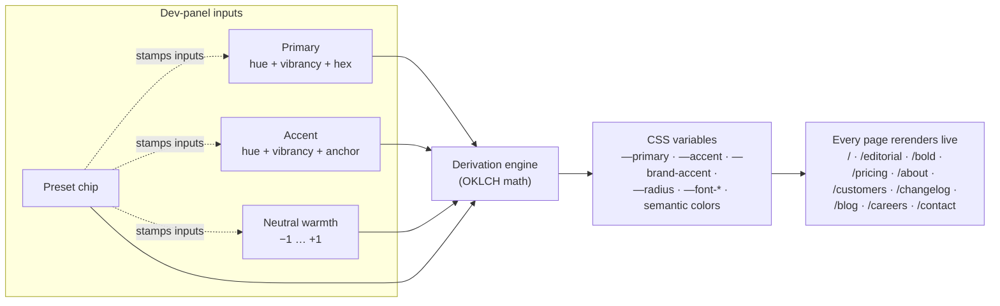

```
 _         _   _           _   
| |___ ___| |_| |_ ___ ___| |_ 
| | . | . | '_| . | . | . | '_|
|_|___|___|_,_|___|___|___|_,_|
```

# Lookbook

> The launch foundation for **MetaModern** — and the reusable Next.js starter kit behind every client pitch, prototype, and one-off that comes after it. Three style variants of every block, a typed dev panel, a controller-driven color system, and a WCAG-aware theme audit baked in.



## What this is for

Lookbook is the codebase **MetaModern launches on**. The product ships from this repo; future client sites and prototypes fork from the same base. So everything below is sized for two audiences simultaneously: the MetaModern launch, and the next ten "we like this direction" projects after it.

## The problem

Every time I started a new pitch — a fictional AI startup for a portfolio piece, a real prototype for a client, a quick "what if it looked like _this_" mockup for a friend — I'd open `create-next-app`, spend an afternoon rebuilding the same hero / features / pricing / footer scaffolding, and burn the rest of the day on color tokens and font choices before any real design work happened.

The pain wasn't the components. It was the empty-page tax. The hour between "I have a direction in my head" and "I have something to look at" was the most expensive hour of every prototype, and it was the same hour every time. So I built the base I wanted to start every project from — and made MetaModern the first thing that uses it.

## Why I built it this way

Most "Next.js starters" optimize for the wrong thing. They give you one polished home page and call it a day. The first time you change directions — "what if it felt more editorial?" — you're rebuilding everything.

The interesting design decision here is the inverse: **every block ships in three variants, and the entire color/type system is a few controls in a dev panel**. So the moment after "I like that direction" isn't "let me wire up a theme config" — it's "let me click the preset and see the whole site already rendered that way."

Three style variants per block: clean editorial, standard SaaS, bold expressive. Same components, same data, same routes. The dev panel exposes the absolute minimum that lets a direction be a *direction*: a primary hue, an accent hue, neutral warmth, and a preset that decides how aggressively those colors get applied to the UI. Everything else — semantic colors, surfaces, contrast, focus rings, radii — derives from those four inputs.

It's also a working answer to a separate question I had: how few controls do you actually need to express a theme? Turns out the answer is "fewer than you'd think, if the derivation engine is honest."

## What ships in the box

- A complete marketing site composition — 10 top-level marketing routes: home + 2 variant homes + pricing, about, customers, changelog, blog (with a sample `[slug]` post template), careers, contact.
- Every block — Hero, Features, Logos, Stats, Testimonials, Pricing, FAQ, CTA, Footer — comes in **three style variants**: `editorial.tsx`, `saas.tsx`, `bold.tsx`. 9 types × 3 variants = **27 block components**.
- A **dev-mode-only floating panel** (toggle with `~`) exposes three brand inputs (Primary, Accent, Neutral warmth), four preset chips (editorial / saas / bold / cyber), and an Advanced disclosure for the underlying derivation profile.
- A **controller-driven color system** in [`src/themes/`](src/themes/) takes those inputs and derives the entire shadcn token surface plus a `brand-accent`, `success`, `warning`, `info`, and `destructive` set. Everything is OKLCH under the hood; paste a hex and it auto-decomposes.
- A separate **`(internal)` route group** behind a shared sidebar — `/sandbox`, `/variants`, `/accessibility`, `/dashboard`, `/login`, `/signup`, `/examples/*` — used as design-system reference and playgrounds. These don't form part of the public marketing site, are noindexed by the internal layout, and are excluded from the sitemap, but they live in the same Next.js app so they always see the live theme.
- A **WCAG 2.2 contrast audit** at [`/accessibility`](src/app/(internal)/accessibility/page.tsx) that scores every theme × mode against the full token-pair catalog. Surfaces a live indicator on the dev panel; also runs headlessly via `pnpm audit:a11y` in CI.
- **All built on**: Next.js 16 App Router with Cache Components, React 19, Tailwind v4, every shadcn/ui component pre-installed (Base UI variant), Motion (`motion/react`), Paper Design Shaders, Leva, no-flash theme bootstrapping.

The fictional demo brand baked in is **Nimbus** — an AI-hype parody used so the scaffold looks like a real site rather than placeholder text. When launching MetaModern (or any client), [`src/lib/brand.ts`](src/lib/brand.ts) gets swapped wholesale and the structure stays.

## How it works

The thing worth understanding is the **derivation pipeline**, because it's why the dev panel can stay flat:

```
ControllerInputs (primary, accent, warmth)
        +
DerivationProfile (chromaBoost, contrast, semanticIntensity,
                   accentUsage, radius, fonts)
        |
        v
deriveTokens()      ← src/themes/derive.ts
  - Resolves Primary OKLCH via vibrancy curve, applies chromaBoost
  - Resolves Accent — either free hue or anchored to primary (+30°, +120°, +180°, −60°)
  - Computes neutral palette from warmth + contrast band (low/medium/high)
  - Generates semantic colors with fixed hues (success 145°, warning 70°,
    destructive 25°, info 215°), chroma scaled by semanticIntensity
  - Picks foregrounds by measured WCAG contrast, not hand-tuning
        |
        v
ColorTokens object → CSS variables on <html> → entire site rerenders
```

**Presets aren't just saved inputs.** Each preset (editorial / saas / bold / cyber) ships its own `DerivationProfile`. Editorial has low chroma boost, high contrast, `rare` accent usage, a tight radius, and a serif heading. Bold has high chroma boost, `maximal` accent usage, and a minimal radius. The same Primary input feels totally different across presets because the derivation profile changes the chroma multiplier, the contrast band, and where the accent is allowed to surface in the UI.

**Picking a preset stamps inputs + derivation.** Editing inputs afterwards (different Primary hue, different warmth) leaves the derivation intact — so the *character* of the preset persists. Re-pick to re-stamp.

**Light↔Dark is automatic.** One set of inputs; the dark mode tokens are derived from the same OKLCH coordinates via a small lightness transform. No second slider to maintain.

**Foregrounds clear AA.** The audit module in [`src/themes/a11y.ts`](src/themes/a11y.ts) scores every token pair against WCAG 2.2 contrast; the live indicator in the dev panel flags any pair below threshold. If you tune a theme into a corner, you'll see it before shipping.

A pre-paint `<ThemeScript>` runs in the document `<head>` and applies the cached theme's CSS variables before React hydrates, so there's no flash between the static stylesheet and the user's last-selected theme.

## Quick start

```bash
git clone https://github.com/davidvictor/lookbook.git
cd lookbook
pnpm install
cp .env.example .env.local   # set NEXT_PUBLIC_SITE_URL=http://localhost:3000
pnpm dev
```

Open [http://localhost:3000](http://localhost:3000).

Press `~` (tilde / backtick — same physical key, no modifier) to open the dev panel.

```bash
pnpm dev          # next dev
pnpm build        # production build (also runs in CI before merge)
pnpm check        # Biome lint + format + polish check
pnpm typecheck    # tsc --noEmit
pnpm test         # vitest run
pnpm audit:a11y   # WCAG 2.2 contrast audit over every theme × mode
```

## Deploy

The repo is set up for one-click deploy to Vercel:

1. Push to GitHub.
2. In Vercel, "Import Project" pointed at the repo. Framework auto-detected as Next.js — no `vercel.json` needed.
3. Set the production env var: **`NEXT_PUBLIC_SITE_URL=https://yourdomain.com`** (Settings → Environment Variables).
4. (Optional) Add a custom domain in Settings → Domains.

For per-client setup of a Lookbook-based project, follow [`docs/PROJECT_SETUP.md`](docs/PROJECT_SETUP.md) — clone-and-rename checklist.

## Workflow

- **Conventional Commits** are enforced via commitlint. Pattern: `<type>(<scope>): <subject>` with types `feat`, `fix`, `docs`, `refactor`, `style`, `test`, `chore`, `perf`, `ci`, `build`.
- **Pre-commit hook** (husky) runs `lint-staged` (Biome on staged files) + `tsc --noEmit` + Vitest on changed-since-main tests.
- **CI** (GitHub Actions) runs `pnpm check → typecheck → test → audit:a11y → build` on every PR.
- **Agents**: read [`AGENTS.md`](AGENTS.md) first. Claude-specific notes in [`CLAUDE.md`](CLAUDE.md). The client-facing playbook for vibe-coding changes is at [`docs/CLIENT_PLAYBOOK.md`](docs/CLIENT_PLAYBOOK.md).

## Where to look first

| Path | What's there |
|---|---|
| [`src/app/(marketing)/page.tsx`](src/app/(marketing)/page.tsx) | The default SaaS-variant home — the page you open first |
| [`src/app/(marketing)/editorial/page.tsx`](src/app/(marketing)/editorial/page.tsx) · [`/bold`](src/app/(marketing)/bold/page.tsx) | Sister homepages composed from the other variant stacks |
| [`src/app/(internal)/variants/page.tsx`](src/app/(internal)/variants/page.tsx) | Block × style gallery: every block × 3 variants, side-by-side |
| [`src/app/(internal)/sandbox/`](src/app/(internal)/sandbox/) | Per-surface shadcn references (colors, typography, forms, surfaces, navigation, overlays, polish) plus an `/all` aggregator |
| [`src/app/(internal)/accessibility/page.tsx`](src/app/(internal)/accessibility/page.tsx) | WCAG 2.2 audit overview — every theme × mode, every token pair |
| [`src/components/blocks/`](src/components/blocks/) | The 27 block files, organized as `<type>/{editorial,saas,bold}.tsx` |
| [`src/components/dev-panel/`](src/components/dev-panel/) | The panel itself + the `useDevControls` / `useDevData` hooks |
| [`src/themes/`](src/themes/) | Color system: `derive.ts` (engine), `registry.json` (the four base presets + saved customs), `a11y.ts` (contrast scoring) |
| [`src/lib/color.ts`](src/lib/color.ts) | OKLCH math, hex conversions, vibrancy curve, warmth model |
| [`src/lib/brand.ts`](src/lib/brand.ts) | All Nimbus copy in one file — swap it out per prototype. Numeric data uses typed shapes from `@/lib/format` |
| [`src/config/`](src/config/) | `site.ts` (site name, nav, social) + `env.ts` (zod-validated envs) |
| [`docs/UI_POLISH.md`](docs/UI_POLISH.md) · [`docs/adr/`](docs/adr/) | The polish + a11y systems, grounded in 19 ADRs |

## Routes that ship

### Marketing — the public site

| Route | Purpose |
|---|---|
| `/` | SaaS-default home — full marketing stack |
| `/editorial` · `/bold` | Same site, different variant compositions |
| `/pricing` · `/about` · `/customers` · `/changelog` | Standard marketing surfaces |
| `/blog` · `/blog/[slug]` | Blog index + sample post with a minimal markdown renderer |
| `/careers` · `/contact` | Form + role list |

### `(internal)` — design-system + playgrounds (shared sidebar)

These live in an `(internal)` route group with its own sidebar layout. Always available in dev; per-project you choose whether to deploy them publicly or strip them out.

| Route | Purpose |
|---|---|
| `/sandbox` | Card-grid index of every component surface under the active theme |
| `/sandbox/{colors,typography,forms,surfaces,navigation,overlays,polish}` | Per-surface references |
| `/sandbox/all` | One-page aggregator with sticky TOC |
| `/variants` | Block × style gallery |
| `/accessibility` | WCAG 2.2 contrast audit overview, every theme × mode |
| `/examples/{motion,shaders,blocks}` | Playgrounds for animation, shaders, and shadcn marketing blocks |
| `/login` · `/signup` · `/dashboard` | shadcn auth + dashboard blocks under the live theme |

### API

| Route | Purpose |
|---|---|
| `/api/health` | Health check — reads raw `process.env` directly so it stays up even when env validation would fail |

## Tweaking the demo brand

The whole fictional company lives in [`src/lib/brand.ts`](src/lib/brand.ts) — taglines, features, customers, pricing tiers, testimonials, FAQ, blog posts, jobs, values. Replace one constant at a time and the pages update.

For real prototypes (including MetaModern), the recommended path is:

1. Pick a preset that's in the rough neighborhood of the direction.
2. Tune Primary / Accent / Warmth until the colors feel right.
3. Open `/variants` (under the internal sidebar) to decide which block style suits each section.
4. Compose your home from the chosen variant components.
5. Edit `brand.ts` and the page files for content.
6. Run `pnpm audit:a11y` before shipping — the dev panel's live indicator should already be green.

## Tech stack

- **Next.js 16** App Router with `cacheComponents: true`
- **React 19** + **TypeScript** strict
- **Tailwind v4** with `@theme inline`
- **shadcn/ui** Base UI variant — every component pre-installed
- **Motion** (`motion/react`) — `FadeIn` and `Stagger` primitives included
- **@paper-design/shaders-react** — WebGL mesh gradients used in the SaaS hero, bold hero, and CTA blocks
- **Leva** — embedded in the dev panel for fast control prototyping
- **Vitest** — pure-logic unit tests (color math, audit module, brand tuner)
- **Biome** — single tool for format + lint
- **Husky + commitlint + lint-staged** — pre-commit discipline
- **pnpm 10** — package manager; **Node 22** required

## Limitations

- Some shadcn block components (`data-table.tsx`, the sidebar variants) were generated against an older shadcn API and have small patches applied. They work; they may look slightly different from the latest shadcn block exports.
- `@base-ui/utils` ships a module-level `Math.random()` call that violates Cache Components. The repo applies a patch in [`patches/`](patches/) to remove it; `pnpm install` applies it automatically.
- The pre-derived CSS variables in `<ThemeScript>` only cover the *base* themes shipped in `registry.json`. If you create a brand-new custom theme via the dev panel, there'll be a one-frame flash on the very next reload until React hydrates. (Edits to existing themes don't flash — base tokens still match on first paint.)
- The motion/shader example pages assume client-side rendering — they don't try to be SSR-friendly and don't need to be.
- Tested on macOS with Node 22 and pnpm 10. Should work on Linux/Windows but the dev experience is most polished on macOS.
- The fictional company name ("Nimbus") is just demo content. Replace it with real content (MetaModern, client brand, etc.) before shipping.

## Polish + accessibility

The motion primitives, surface treatments, hit-area rules, and tabular-number conventions that make the system feel crafted are documented in [`docs/UI_POLISH.md`](docs/UI_POLISH.md) and grounded in 19 ADRs in [`docs/adr/`](docs/adr/). The reference page lives at [`/sandbox/polish`](src/app/(internal)/sandbox/polish/page.tsx) — every primitive, surface, spring tier, and the reduced-motion preview toggle, side-by-side.

Accessibility is treated as a first-class derivation output, not a post-hoc check:

- [`src/themes/a11y.ts`](src/themes/a11y.ts) scores every theme × mode against the token-pair catalog using measured WCAG 2.2 contrast.
- The dev panel shows a live indicator. A red dot on the panel toggle means at least one pair is below threshold under the current theme.
- [`/accessibility`](src/app/(internal)/accessibility/page.tsx) makes the same audit browsable: filter by theme, mode, or pair; deep-link to specific failures.
- `pnpm audit:a11y` runs the audit headlessly in CI. The check fails the build if any pair regresses below AA.
- ADR [`0019-theme-accessibility.md`](docs/adr/0019-theme-accessibility.md) captures the contract: foregrounds are *picked by measured contrast*, not hand-tuned.

Guardrails: `pnpm check:polish` (also wired into `pnpm check`) greps for `transition-all`, raw `` without an outline, ad-hoc shadow utilities, and inline `font-variant-numeric` declarations.

## License

MIT — see [LICENSE](LICENSE).
