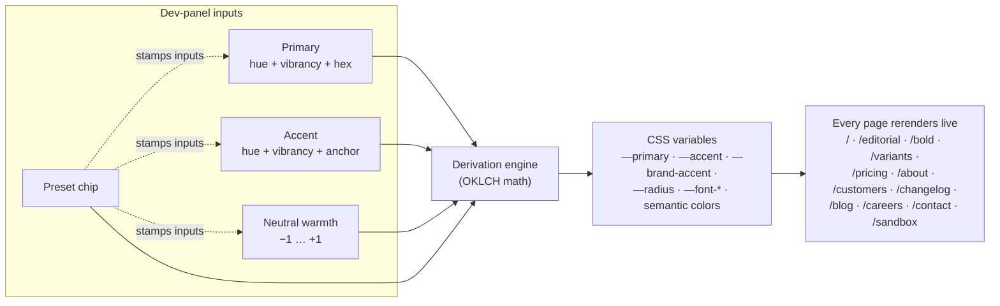

```
 _         _   _           _   
| |___ ___| |_| |_ ___ ___| |_ 
| | . | . | '_| . | . | . | '_|
|_|___|___|_,_|___|___|___|_,_|
```

# Lookbook

> A Next.js base for going from "we like this direction" to a clickable page in one sitting. Three style variants of every block, a typed dev panel, and a controller-driven color system.



## The problem

Every time I started a new pitch — a fictional AI startup for a portfolio piece, a real prototype for a client, a quick "what if it looked like _this_" mockup for a friend — I'd open `create-next-app`, spend an afternoon rebuilding the same hero / features / pricing / footer scaffolding, and burn the rest of the day on color tokens and font choices before any real design work happened.

The pain wasn't the components. It was the empty-page tax. The hour between "I have a direction in my head" and "I have something to look at" was the most expensive hour of every prototype, and it was the same hour every time.

## Why I built it

Most "Next.js starters" optimize for the wrong thing. They give you one polished home page and call it a day. The first time you change directions — "what if it felt more editorial?" — you're rebuilding everything.

The interesting design decision here is the inverse: **every block ships in three variants, and the entire color/type system is a few controls in a dev panel**. So the moment after "I like that direction" isn't "let me wire up a theme config" — it's "let me click the preset and see eight pages already rendered that way."

Three style variants per block: clean editorial, standard SaaS, bold expressive. Same components, same data, same routes. The dev panel exposes the absolute minimum that lets a direction be a *direction*: a primary hue, an accent hue, neutral warmth, and a preset that decides how aggressively those colors get applied to the UI. Everything else — semantic colors, surfaces, contrast, focus rings, radii — derives from those four inputs.

It's also a working answer to a separate question I had: how few controls do you actually need to express a theme? Turns out the answer is "fewer than you'd think, if the derivation engine is honest."

## What it does

- Ships a complete fictional marketing site (12 pages: home + 3 variant homes + pricing/about/customers/changelog/blog+post/careers/contact + a sandbox + a variants gallery)
- Every block — Hero, Features, Logos, Stats, Testimonials, Pricing, FAQ, CTA, Footer — comes in **three style variants**: `editorial.tsx`, `saas.tsx`, `bold.tsx`. 27 components total.
- A **dev-mode-only floating panel** (toggle with `~`) exposes three brand inputs (Primary, Accent, Neutral warmth), four preset chips, and an Advanced disclosure for the underlying derivation profile.
- A **controller-driven color system** in [`src/themes/`](src/themes/) takes those inputs and derives the entire shadcn token surface plus a `brand-accent`, `success`, `warning`, and `info` set. Everything is OKLCH under the hood; you can paste a hex and it auto-decomposes.
- A **canonical `/sandbox`** route that shows every shadcn component plus the live color tokens — useful as a design-system reference per theme.
- **All built on**: Next.js 16 App Router with Cache Components, Tailwind v4, every shadcn/ui component pre-installed (Base UI variant), Motion (`motion/react`), Paper Design Shaders, Leva, next-themes-style mode switching with no flash.

The fictional company that comes baked in is called **Nimbus** — an AI-hype parody. The copy is intentionally a little unhinged. Replace it with real content; the structure stays.

## How it works

The thing worth understanding is the **derivation pipeline**, because it's why the dev panel can stay flat:

```
ControllerInputs (primary, accent, warmth)
        +
DerivationProfile (chromaBoost, contrast, semanticIntensity,
                   accentUsage, radius, fonts)
        |
        v
deriveTokens()      ← src/themes/derive.ts
  - Resolves Primary OKLCH via vibrancy curve, applies chromaBoost
  - Resolves Accent — either free hue or anchored to primary (+30°, +120°, +180°, −60°)
  - Computes neutral palette from warmth + contrast band (low/medium/high)
  - Generates semantic colors with fixed hues (success 145°, warning 70°,
    destructive 25°, info 215°), chroma scaled by semanticIntensity
  - Picks foregrounds via luminance, not hand-tuning
        |
        v
ColorTokens object → CSS variables on <html> → entire site rerenders
```

**Presets aren't just saved inputs.** Each preset (editorial / saas / bold / cyber) ships its own `DerivationProfile`. Editorial has low chroma boost, high contrast, `rare` accent usage, a tight radius, and a serif heading. Bold has high chroma boost, `maximal` accent usage, and a minimal radius. The same Primary input feels totally different across presets because the derivation profile changes the chroma multiplier, the contrast band, and where the accent is allowed to surface in the UI.

**Picking a preset stamps inputs + derivation.** Editing inputs afterwards (different Primary hue, different warmth) leaves the derivation intact — so the *character* of the preset persists. Re-pick to re-stamp.

**Light↔Dark is automatic.** One set of inputs; the dark mode tokens are derived from the same OKLCH coordinates via a small lightness transform. No second slider to maintain.

A pre-paint `<ThemeScript>` runs in the document `<head>` and applies the cached theme's CSS variables before React hydrates, so there's no flash between the static stylesheet and the user's last-selected theme.

## Quick start

```bash
git clone https://github.com/davidvictor/lookbook.git
cd lookbook
pnpm install
pnpm dev
```

Open [http://localhost:3000](http://localhost:3000).

Press `~` (tilde / backtick — same physical key, no modifier) to open the dev panel.

```bash
# Production build (run before opening a PR)
pnpm build

# Format / lint with Biome
pnpm check
```

## Where to look first

| Path | What's there |
|---|---|
| [`src/app/(marketing)/page.tsx`](src/app/(marketing)/page.tsx) | The default SaaS-variant home — the page you open first |
| [`src/app/(marketing)/editorial/page.tsx`](src/app/(marketing)/editorial/page.tsx) · [`/bold`](src/app/(marketing)/bold/page.tsx) | Sister homepages composed from the other variant stacks |
| [`src/app/(marketing)/variants/page.tsx`](src/app/(marketing)/variants/page.tsx) | The design-system reference: every block × 3 styles, side-by-side |
| [`src/components/blocks/`](src/components/blocks/) | The 27 block files, organized as `<type>/{editorial,saas,bold}.tsx` |
| [`src/components/dev-panel/`](src/components/dev-panel/) | The panel itself + the `useDevControls` / `useDevData` hooks |
| [`src/themes/`](src/themes/) | The color system: `derive.ts` is the engine, `presets.ts` is where the four presets live, `registry.json` is the persisted theme list |
| [`src/lib/color.ts`](src/lib/color.ts) | OKLCH math, hex conversions, the vibrancy curve, the warmth model |
| [`src/lib/brand.ts`](src/lib/brand.ts) | All Nimbus copy in one file — swap it out per prototype |

## Routes that ship

| Route | Purpose |
|---|---|
| `/` | SaaS-default home — full marketing stack |
| `/editorial` · `/bold` | Same site, different variant compositions |
| `/variants` | Block × style gallery with section TOC |
| `/sandbox` | shadcn component reference under the active theme |
| `/pricing` · `/about` · `/customers` · `/changelog` | Standard marketing surfaces |
| `/blog` · `/blog/[slug]` | Blog index + a sample post with a min-markdown renderer |
| `/careers` · `/contact` | Form + role list |
| `/examples/{motion,shaders,blocks}` | Playground for animation, shaders, and block experiments |

## Tweaking the demo brand

The whole fictional company lives in [`src/lib/brand.ts`](src/lib/brand.ts) — taglines, features, customers, pricing tiers, testimonials, FAQ, blog posts, jobs, values. Replace one constant at a time and the pages update.

For real prototypes, the recommended path is:

1. Pick a preset that's in the rough neighborhood of the direction.
2. Tune Primary / Accent / Warmth until the colors feel right.
3. Open `/variants` to decide which block style suits each section.
4. Compose your home from the chosen variant components.
5. Edit `brand.ts` and the page files for content.

## Tech stack

- **Next.js 16** App Router with `cacheComponents: true` (Partial Prerendering)
- **React 19** + **TypeScript** strict
- **Tailwind v4** with `@theme inline`
- **shadcn/ui** Base UI variant — every component pre-installed
- **Motion** (`motion/react`) — `FadeIn` and `Stagger` primitives included
- **@paper-design/shaders-react** — WebGL mesh gradients used in the SaaS hero, bold hero, and CTA blocks
- **Leva** — embedded in the dev panel for fast control prototyping
- **Biome** — single tool for format + lint
- **pnpm** — package manager; **Node 22** required

## Limitations

- Some shadcn block components (`data-table.tsx`, the sidebar variants) were generated against an older shadcn API and have a few small patches applied. They work; they may look slightly different from the latest shadcn block exports.
- The pre-derived CSS variables in `<ThemeScript>` only cover the *base* themes shipped in `registry.json`. If you create a brand-new custom theme via the dev panel, there'll be a one-frame flash on the very next reload until React hydrates. (Edits to existing themes don't flash — base tokens still match on first paint.)
- The motion/shader example pages assume client-side rendering — they don't try to be SSR-friendly and don't need to be.
- Tested on macOS with Node 22 and pnpm 10. Should work on Linux/Windows but the dev experience is most polished on macOS.
- The fictional company name ("Nimbus") is just demo content. Replace it before showing this to anyone who'll think it's a real product.

## What's next

- A non-flash path for user-created themes (currently only base themes are pre-derived in the inline script)
- A "save to registry.json" server action so editing themes in the dev panel can be persisted back to the source file in development
- Optional Storybook export of the 27 block variants
- More presets — `mono`, `aurora`, `print` are all sitting half-formed in notes

## License

MIT — see [LICENSE](LICENSE).
