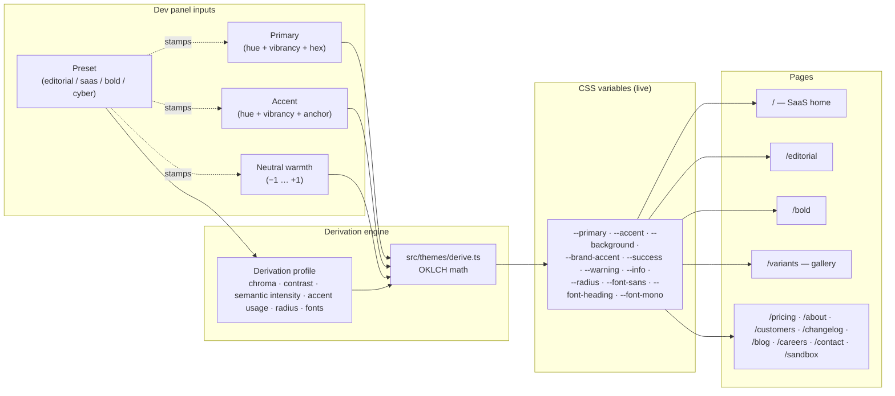
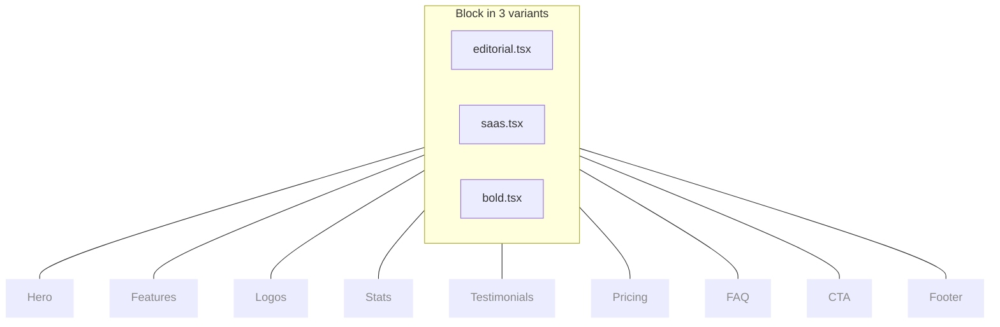

# Lookbook — at a glance

```mermaid
flowchart LR
  subgraph Inputs[" Dev panel inputs "]
    primary["Primary<br/>(hue + vibrancy + hex)"]
    accent["Accent<br/>(hue + vibrancy + anchor)"]
    warmth["Neutral warmth<br/>(−1 … +1)"]
    preset["Preset<br/>(editorial / saas / bold / cyber)"]
  end

  subgraph Engine[" Derivation engine "]
    derive["src/themes/derive.ts<br/>OKLCH math"]
    profile["Derivation profile<br/>chroma · contrast · semantic intensity · accent usage · radius · fonts"]
  end

  subgraph Output[" CSS variables (live) "]
    tokens["--primary · --accent · --background ·<br/>--brand-accent · --success · --warning · --info ·<br/>--radius · --font-sans · --font-heading · --font-mono"]
  end

  subgraph Pages[" Pages "]
    home["/ — SaaS home"]
    ed["/editorial"]
    bold["/bold"]
    variants["/variants — gallery"]
    rest["/pricing · /about · /customers · /changelog ·<br/>/blog · /careers · /contact · /sandbox"]
  end

  primary --> derive
  accent --> derive
  warmth --> derive
  preset -. stamps .-> primary
  preset -. stamps .-> accent
  preset -. stamps .-> warmth
  preset --> profile
  profile --> derive
  derive --> tokens
  tokens --> home
  tokens --> ed
  tokens --> bold
  tokens --> variants
  tokens --> rest
```

```mermaid
flowchart TB
  subgraph Block[" Block in 3 variants "]
    direction LR
    editorial["editorial.tsx"]
    saas["saas.tsx"]
    boldv["bold.tsx"]
  end

  Block --- HeroBlock["Hero"]
  Block --- FeaturesBlock["Features"]
  Block --- LogosBlock["Logos"]
  Block --- StatsBlock["Stats"]
  Block --- TestimonialsBlock["Testimonials"]
  Block --- PricingBlock["Pricing"]
  Block --- FaqBlock["FAQ"]
  Block --- CtaBlock["CTA"]
  Block --- FooterBlock["Footer"]

  classDef inv stroke-width:0,color:#888
  class HeroBlock,FeaturesBlock,LogosBlock,StatsBlock,TestimonialsBlock,PricingBlock,FaqBlock,CtaBlock,FooterBlock inv
```
